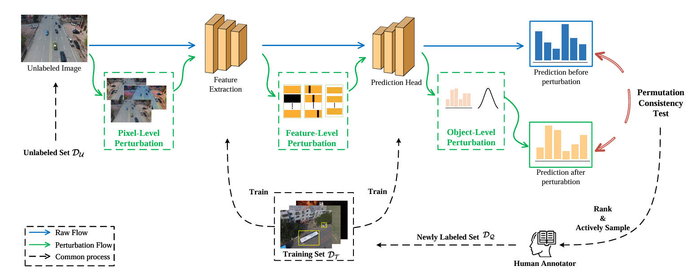

# HiCAL Overview

PyTorch implementation of "**HiCAL: Hierarchical Consistency-based Active Learning for Drone-View Object Detection **", which has been accepted by TGRS-2025.



## Installation

To get all the requirements, please run
```
pip install -r requirements.txt
```

## Usage

Take the dataset Visdrone2019 as example.

### YOLOv9

Training:
1. download the Visdrone2019 dataset [BaiDu](https://pan.baidu.com/s/1EE_mSVRuS_gsE4OMjpcUQA?pwd=4sk8)(Code:4sk8) and put it in the `dataset` folder.

2. get the init 500 images dataset from train:
```
python YOLOv9/tools/split_init_dataset.py 
```

3. download the [pre-trained weights](https://github.com/WongKinYiu/yolov9/releases/download/v0.1/yolov9-c.pt) of YOLOv9-c, and put it in the `YOLOv9` folder.

4. modify the `YOLOv9/data/VisDrone.yaml`:
```yaml
train: ../dataset/VisDrone_part/init
val: ../dataset/VisDrone/val
```

5. train the model to get the init weights:

```python
python YOLOv9/train_dual.py --weights YOLOv9/yolov9-c.pt
```
The trained weights can be downloaded from [BaiDu](https://pan.baidu.com/s/1uveTleRDReY85sO0cXxFIw?pwd=hhik)(Code:hhik).

6. sampling using the initial trained model:

```python
python YOLOv9/tools/final_disturbance.py  
```

7. train the model with initial sample and sample selected by active learning.

Evaluation and Inference is same as [YOLOv9](https://github.com/WongKinYiu/yolov9/blob/main/README.md).

### Other Detectors

Similar to YOLOv9, [Faster-RCNN](https://github.com/WZMIAOMIAO/deep-learning-for-image-processing/tree/master/pytorch_object_detection/faster_rcnn) and [RT-DETRv2](https://github.com/lyuwenyu/RT-DETR) can be used in the same way.

## Citation

If you are interested in the work, or find the code helpful, please cite our work

```bash
@ARTICLE{11026016,
  author={Zhang, Xingyu and Liu, Yongxu and Li, Aobo and Han, Kun and Zhao, Qinghang and Wu, Jinjian},
  journal={IEEE Transactions on Geoscience and Remote Sensing}, 
  title={HiCAL: Hierarchical Consistency-Based Active Learning for Drone-View Object Detection}, 
  year={2025},
  volume={63},
  number={},
  pages={1-14},
  keywords={Object detection;Active learning;Predictive models;Annotations;Perturbation methods;Feature extraction;Costs;Uncertainty;Training;Data models;Active learning;aerial object detection;drone-view object detection;hierarchical consistency},
  doi={10.1109/TGRS.2025.3576980}}
```